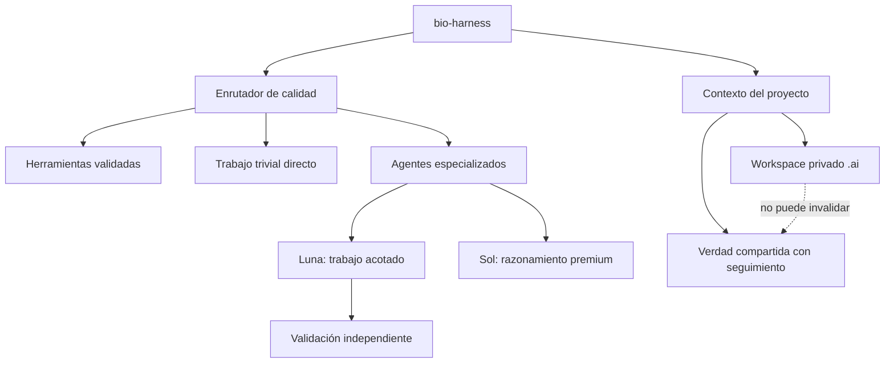

# bio-harness

bio-harness es un harness personal de ingeniería para Codex que prioriza la calidad. Controla el contexto, el estado privado del proyecto, el enrutamiento de modelos, los agentes especializados, las herramientas reutilizables, la validación y los límites de aprobación humana sin convertir silenciosamente el flujo de trabajo de IA de una persona en una política de equipo.

## Por qué existe bio-harness

El modelo escribe código. El harness decide qué ve, qué recuerda, qué puede modificar y cómo se valida el trabajo.

El objetivo no es reducir tokens por sí solo. Las decisiones siguen este orden:

1. corrección;
2. seguridad;
3. calidad de razonamiento requerida por la tarea;
4. fiabilidad y reproducibilidad;
5. luego coste, tokens, contexto y latencia.

«Cheapest sufficient» significa la ruta menos costosa que ya haya demostrado, o esté sólidamente justificada para alcanzar, el nivel de calidad requerido. El trabajo de alto riesgo no comienza con un modelo más débil sólo para comprobar si falla.

## Arquitectura



El repositorio fuente contiene archivos de staging inertes y revisables. La instalación copia un subconjunto validado al runtime global de Codex. El estado privado específico de cada proyecto permanece bajo `.ai/` en cada proyecto adoptado.

Consulta la [guía de arquitectura](docs/architecture.md).

## Enrutamiento de modelos

El híbrido validado mantiene el orquestador en GPT-5.6 Sol/medium y utiliza workers Luna acotados allí donde aprobaron fixtures específicas del rol.

| Rol | Modelo | Esfuerzo | Propósito |
|---|---|---|---|
| Orchestrator | GPT-5.6 Sol | medium | Delimitar, enrutar, integrar e informar |
| Researcher | GPT-5.6 Luna | medium | Descubrimiento de repositorio y evidencia en modo read-only |
| Quick implementer | GPT-5.6 Luna | low | Cambios explícitos, acotados y de bajo riesgo |
| Implementer | GPT-5.6 Luna | medium | Features normales y reparaciones en varios archivos |
| Validator | GPT-5.6 Luna | low | Comprobaciones enfocadas e independientes; sin reparar |
| Planner | GPT-5.6 Sol | medium | Planificación de arquitectura y migraciones con consecuencias relevantes |
| Reviewer | GPT-5.6 Sol | low | Revisión independiente justificada por el riesgo |

El candidato parent Luna/medium está **bloqueado**. Produjo tres regresiones materiales de enrutamiento en el quality red-team. Consulta [enrutamiento de modelos](docs/model-routing.md) y [evidencia de calidad](docs/quality-redteam.md).

## Workspace privado del proyecto

El estado personal de IA usa `.ai/` de forma predeterminada y se excluye mediante el exclude local del repositorio, no mediante el `.gitignore` con seguimiento. `.ai/PROJECT.md` es un enrutador privado compacto, no una autoridad del equipo. Las demás specs privadas, el estado, las notas de auditoría y las herramientas sólo se activan cuando hacen falta.

Las instrucciones con seguimiento, la arquitectura, los contratos, el código fuente, los tests y la documentación del equipo siguen siendo la verdad compartida. La promoción de hallazgos privados a documentación compartida es explícita y pasa por human gate cuando modifica un contrato del equipo. Consulta [workspaces privados](docs/private-workspace.md).

## Toolbox

Las skills enseñan cómo trabajar o razonar. Las tools realizan trabajo mecánico determinista. bio-harness busca manifests pequeños antes de volver a generar helpers no triviales, valida la contención sin ejecutar código durante el descubrimiento y mantiene las herramientas del proyecto separadas de la toolbox global aprobada por el humano. Consulta el [diseño de la toolbox](docs/toolbox.md).

## project-bootstrap

La skill project-bootstrap incluida inspecciona la realidad existente antes de proponer la capa privada útil más pequeña. Clasifica rutas que parecen relacionadas con IA, establece privacidad local sólo cuando es seguro y nunca instala el blueprint completo en bloque. Consulta [bootstrap de proyectos](docs/project-bootstrap.md) y [SDD proporcional](docs/sdd.md).

## Seguridad

Los cambios materiales destructivos, irreversibles, de seguridad, migración, contrato público, promoción global y otros sujetos a límites de autoridad siguen:

`PROPOSE → IMPACT → PREVIEW → APPROVAL → EXECUTE → VALIDATE`

La repetición nunca concede autoridad. Consulta [seguridad y human gates](docs/safety.md).

## Validación

La suite determinista cubre migración/rollback, privacidad local de Git, contención de herramientas, pins de agentes, presupuestos de contexto, vigencia de evidencia y mecanismos del quality gate. El red-team basado en resultados comparó fixtures de parent idénticas y evaluó de forma independiente cada rol worker.

```bash
python3 -B staging/audit/validate_staging.py
```

Resultado actual: pasan 38 tests unificados, junto con 67 fixtures de calidad, 3 tests de toolbox y 4 tests de privacidad. La evidencia detallada permanece en [`staging/audit/`](staging/audit/README.md).

## Estructura del repositorio

```text
bio-harness/
├── docs/                  # Guías de usuario y desarrollo
├── staging/
│   ├── global/            # Candidatos globales instalables
│   ├── blueprint/         # Menú inerte de plantillas privadas de proyecto
│   ├── migration/         # Fuente de instalación y rollback transaccionales
│   └── audit/             # Tests, fixtures, resultados y procedencia
└── migration-execution/   # Fuente histórica de la migración V1
```

Consulta [estructura del repositorio](docs/repository-layout.md) para conocer la propiedad y el ciclo de vida.

## Instalación

La instalación tiene en cuenta los hashes, crea backups, es transaccional y está separada de la adopción de proyectos. Lee [instalación y rollback](docs/installation.md) antes de ejecutar comandos de migración. La migración opcional del modelo parent es una operación separada y sigue bloqueada.

## Desarrollo

Comienza por el [índice de documentación](docs/README.md) y la [guía de desarrollo](docs/development.md). Modifica la fuente en staging, ejecuta validación determinista, obtén una revisión proporcional al riesgo e instala únicamente mediante las herramientas de migración.

## Estado

El harness V2 híbrido está **validado** e **instalado localmente**. El parent activo aprobado es GPT-5.6 Sol/medium. Los workers Luna sólo están aprobados para los roles acotados indicados. El repositorio conserva fuente reproducible y evidencia de auditoría; los backups de la máquina y el estado de runtime se excluyen deliberadamente.
