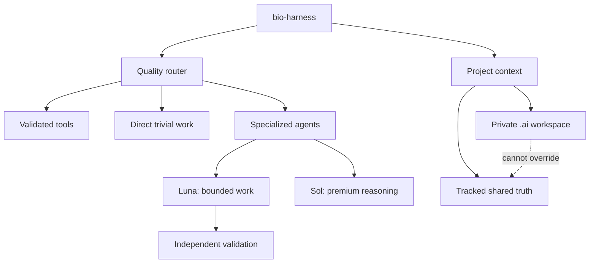

# bio-harness

bio-harness is a quality-first personal Codex engineering harness. It controls context, private project state, model routing, specialized agents, reusable tools, validation, and human approval boundaries without silently turning one person's AI workflow into team policy.

## Why bio-harness exists

The model writes code. The harness decides what it sees, what it remembers, what it can touch, and how the work is validated.

The objective is not token reduction by itself. Decisions follow this order:

1. correctness;
2. safety;
3. task-required reasoning quality;
4. reliability and reproducibility;
5. then cost, tokens, context, and latency.

“Cheapest sufficient” means the least expensive route already demonstrated or strongly justified to meet the required quality floor. High-risk work does not start on a weaker model merely to see whether it fails.

## Architecture



The source repository contains inert, reviewable staged files. Installation copies a validated subset into the global Codex runtime. Project-specific private state remains under `.ai/` in each adopted project.

See [the architecture guide](docs/architecture.md).

## Model routing

The validated hybrid keeps the orchestrator on GPT-5.6 Sol/medium and uses bounded Luna workers where role-specific fixtures passed.

| Role | Model | Effort | Purpose |
|---|---|---|---|
| Orchestrator | GPT-5.6 Sol | medium | Scope, route, integrate, and report |
| Researcher | GPT-5.6 Luna | medium | Read-only repository and evidence discovery |
| Quick implementer | GPT-5.6 Luna | low | Explicit, low-risk bounded changes |
| Implementer | GPT-5.6 Luna | medium | Normal features and multi-file repairs |
| Validator | GPT-5.6 Luna | low | Independent focused checks; no repair |
| Planner | GPT-5.6 Sol | medium | Consequential architecture and migration planning |
| Reviewer | GPT-5.6 Sol | low | Risk-justified independent review |

The Luna/medium parent candidate is **blocked**. It produced three material routing regressions in the quality red-team. See [model routing](docs/model-routing.md) and [quality evidence](docs/quality-redteam.md).

## Private project workspace

Personal AI state defaults to `.ai/`, excluded through the repository-local Git exclude rather than tracked `.gitignore`. `.ai/PROJECT.md` is a compact private router, not team authority. Other private specs, state, audit notes, and tools are activated only when needed.

Tracked instructions, architecture, contracts, source, tests, and team documentation remain shared truth. Promotion from private findings to shared documentation is explicit and human-gated when it changes a team contract. See [private workspaces](docs/private-workspace.md).

## Toolbox

Skills teach how to work or reason. Tools perform deterministic mechanical work. bio-harness searches small manifests before regenerating non-trivial helpers, validates containment without executing code during discovery, and keeps project tools separate from the human-approved global toolbox. See [toolbox design](docs/toolbox.md).

## project-bootstrap

The bundled project-bootstrap skill inspects existing reality before proposing the smallest useful private layer. It classifies existing AI-looking paths, establishes local privacy only when safe, and never installs the full blueprint wholesale. See [project bootstrap](docs/project-bootstrap.md) and [proportional SDD](docs/sdd.md).

## Safety

Material destructive, irreversible, security, migration, public-contract, global-promotion, and other authority-boundary actions follow:

`PROPOSE → IMPACT → PREVIEW → APPROVAL → EXECUTE → VALIDATE`

Repetition never grants authority. See [safety and human gates](docs/safety.md).

## Validation

The deterministic suite covers migration/rollback, Git-local privacy, tool containment, agent pins, context budgets, evidence freshness, and quality-gate mechanics. The outcome-based red-team compared identical parent fixtures and independently gated each worker role.

```bash
python3 -B staging/audit/validate_staging.py
```

Current result: 38 unified tests pass, along with 67 quality fixtures, 3 toolbox tests, and 4 privacy tests. Detailed evidence remains under [`staging/audit/`](staging/audit/README.md).

## Repository structure

```text
bio-harness/
├── docs/                  # User and development guides
├── staging/
│   ├── global/            # Installable global candidates
│   ├── blueprint/         # Inert private-project template menu
│   ├── migration/         # Transactional install and rollback source
│   └── audit/             # Tests, fixtures, results, and provenance
└── migration-execution/   # Historical V1 migration source
```

See [repository layout](docs/repository-layout.md) for ownership and lifecycle.

## Installation

Installation is hash-aware, backed up, transactional, and separate from project adoption. Read [installation and rollback](docs/installation.md) before running migration commands. The optional parent-model migration is a separate operation and remains blocked.

## Development

Start with the [documentation index](docs/README.md) and [development guide](docs/development.md). Modify staged source, run deterministic validation, obtain risk-proportionate review, and install only through the migration tooling.

## Status

Harness V2 hybrid is **validated** and **installed locally**. The approved active parent is GPT-5.6 Sol/medium. Luna workers are approved only for their listed bounded roles. The repository records reproducible source and audit evidence; machine backups and runtime state are intentionally excluded.
