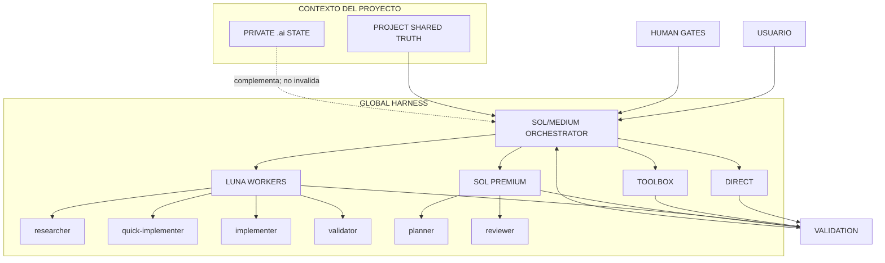
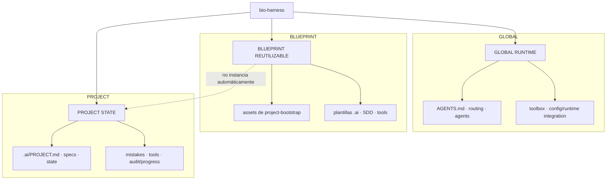
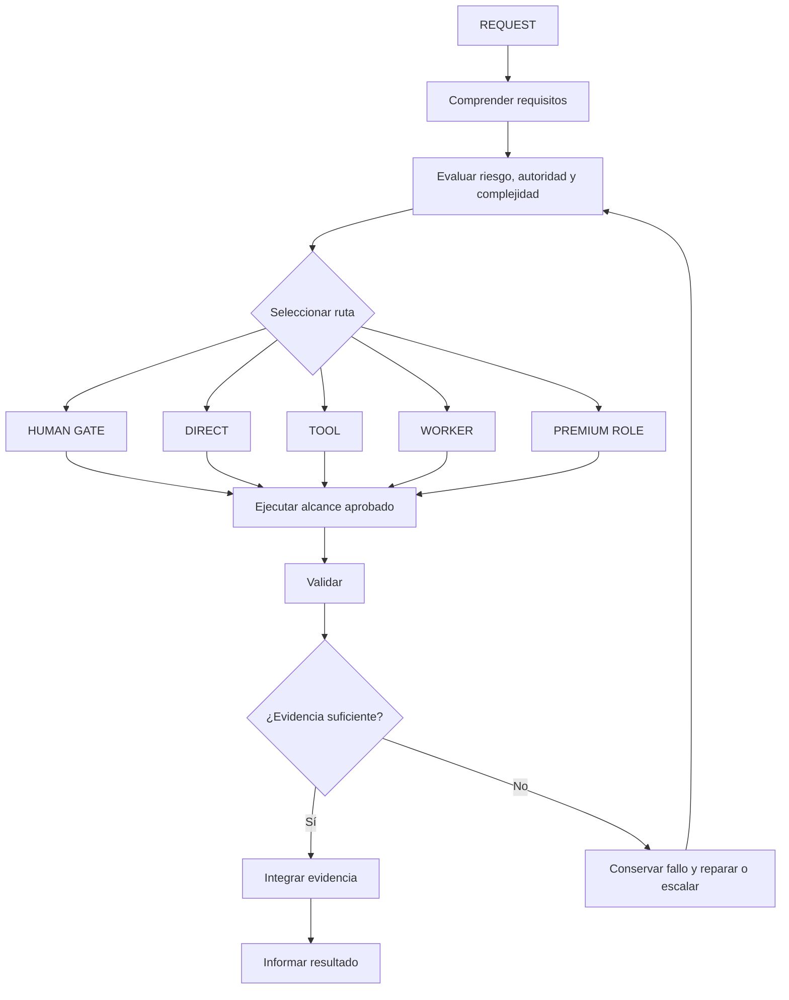
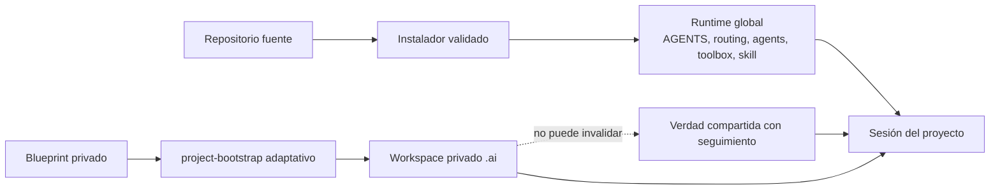
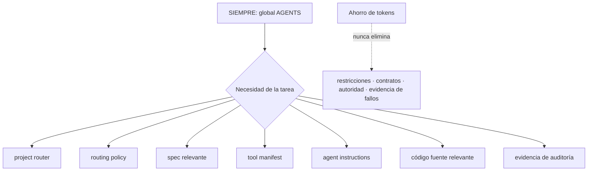

# Arquitectura

bio-harness separa la orquestación, la mecánica determinista, el trabajo acotado de los modelos, el contexto privado del proyecto y la autoridad compartida del proyecto. El runtime es global; la metodología del proyecto permanece privada salvo que se promueva deliberadamente.

## Arquitectura completa del sistema

El orquestador interpreta, enruta e integra. `researcher`, `quick-implementer`, `implementer` y `validator` cubren trabajo Luna acotado; `planner` y `reviewer` reservan Sol para razonamiento con consecuencias relevantes. La verdad compartida gobierna el proyecto, `.ai` aporta contexto privado, los human gates resuelven límites de autoridad y toda afirmación final depende de validación.

## Global, blueprint y proyecto

Staging contiene fuente y posibilidades inertes. Que exista el blueprint no crea `.ai`, specs, registros ni tools en ningún repositorio: `project-bootstrap` inspecciona primero y sólo activa lo necesario con la autoridad adecuada.

## Ciclo de vida de una solicitud

El reintento vuelve a la evaluación con evidencia nueva. No reinicia a ciegas ni prueba primero un modelo débil cuando el riesgo ya justifica un rol premium.

## Estado y autoridad

- **Runtime global**: el pequeño acuerdo siempre cargado, la política de enrutamiento bajo demanda, las definiciones explícitas de agentes, el soporte de toolbox global y la skill project-bootstrap.
- **Blueprint/fuente**: candidatos y plantillas inertes y versionados bajo `staging/`; su presencia no los instala ni activa.
- **Estado privado del proyecto**: artefactos `.ai/` seleccionados y creados sólo después de inspeccionar el proyecto y establecer privacidad local segura.
- **Verdad compartida del proyecto**: instrucciones, contratos, código fuente, tests, arquitectura y documentación del equipo con seguimiento. Las contradicciones con `.ai` se hacen visibles y se resuelven según la autoridad compartida aplicable, salvo que un humano cambie ese contrato.

## Divulgación progresiva

Sólo se cargan capas profundas cuando aportan algo a la tarea. El `AGENTS.md` global permanece pequeño; specs, manifests, implementación y evidencia se leen bajo demanda. Ahorrar contexto nunca justifica omitir un requisito crítico o un límite de aprobación.

## Ciclo de vida de fuente a runtime

Los cambios comienzan en staging, pasan una validación determinista y una revisión proporcional y después atraviesan la migración basada en hashes. La instalación V2 ordinaria deja deliberadamente `config.toml` sin cambios. La migración del modelo parent es una operación separada y vinculada a evidencia.
