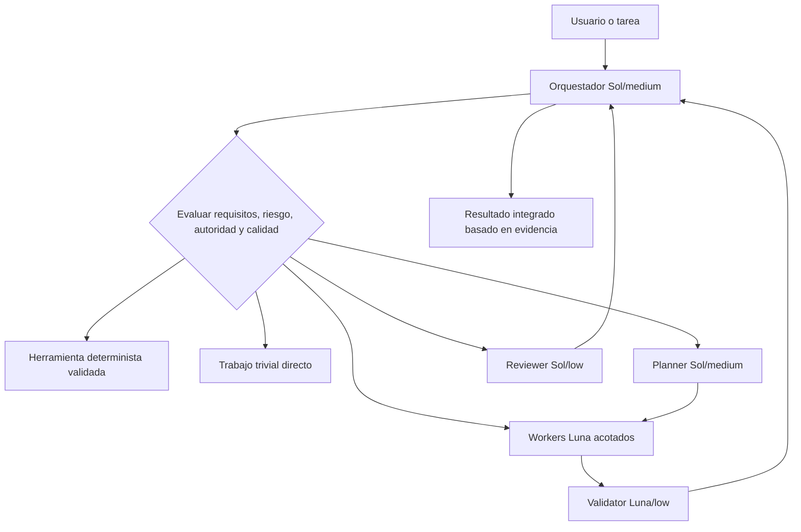
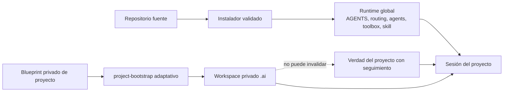

# Arquitectura

bio-harness separa la orquestación, la mecánica determinista, el trabajo acotado de los modelos, el contexto privado del proyecto y la autoridad compartida del proyecto. El runtime es global; la metodología del proyecto permanece privada salvo que se promueva deliberadamente.

## Arquitectura de ejecución

El orquestador es responsable de la interpretación, el enrutamiento, la integración, los human gates y la afirmación final. No delega por ceremonia. El razonamiento premium se selecciona antes de ejecutar cuando el riesgo previsto de arquitectura, migración, datos duraderos, seguridad, concurrencia, destrucción o contrato público lo justifica.

## Estado y autoridad

- **Runtime global**: el pequeño acuerdo siempre cargado, la política de enrutamiento bajo demanda, las definiciones explícitas de agentes, el soporte de toolbox global y la skill project-bootstrap.
- **Blueprint/fuente**: candidatos y plantillas inertes y versionados bajo `staging/`; su presencia no los instala ni activa.
- **Estado privado del proyecto**: artefactos `.ai/` seleccionados y creados sólo después de inspeccionar el proyecto y establecer privacidad local segura.
- **Verdad compartida del proyecto**: instrucciones, contratos, código fuente, tests, arquitectura y documentación del equipo con seguimiento. Las contradicciones con `.ai` se hacen visibles y se resuelven a favor de la autoridad compartida aplicable, salvo que un humano cambie ese contrato.

## Divulgación progresiva

El `AGENTS.md` global permanece pequeño. El enrutador del proyecto y la política detallada de enrutamiento de modelos sólo se cargan cuando corresponda. Las specs, los manifests de herramientas, el código fuente de implementación, los registros históricos de auditoría y los diffs completos se leen de forma progresiva. Ahorrar contexto nunca justifica omitir un requisito crítico de la tarea o un límite de aprobación.

## Ciclo de vida de fuente a runtime

Los cambios comienzan en staging, pasan una validación determinista y una revisión proporcional y después atraviesan la migración basada en hashes. La instalación V2 ordinaria deja deliberadamente `config.toml` sin cambios. La migración del modelo parent es una operación separada y vinculada a evidencia.
