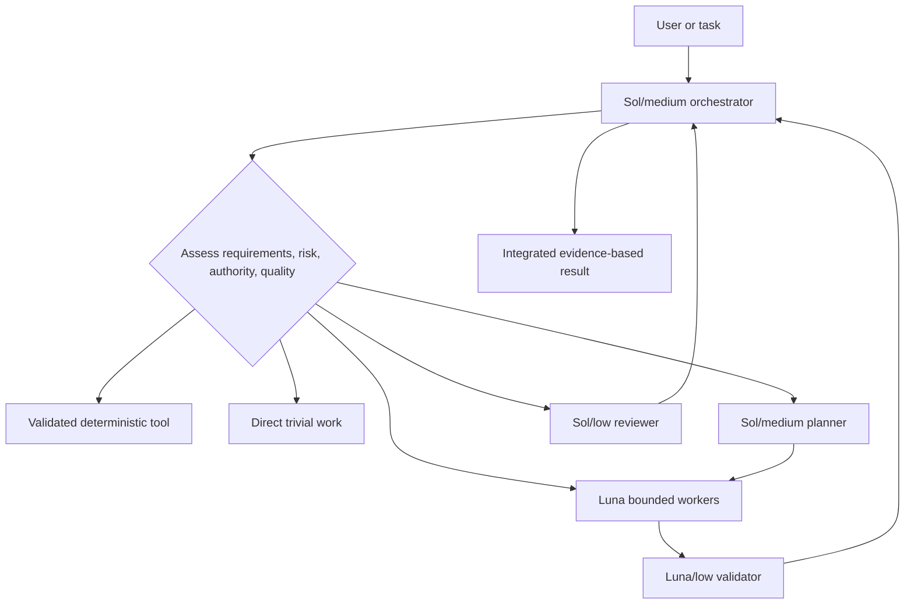
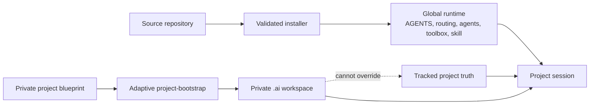

# Architecture

bio-harness separates orchestration, deterministic mechanics, bounded model work, private project context, and shared project authority. The runtime is global; project methodology remains private unless deliberately promoted.

## Execution architecture

The orchestrator owns interpretation, routing, integration, human gates, and the final claim. It does not delegate ceremonially. Premium reasoning is selected before execution when predicted architecture, migration, durable-data, security, concurrency, destructive, or public-contract risk warrants it.

## State and authority

- **Global runtime**: the small always-loaded agreement, on-demand routing policy, explicit agent definitions, global toolbox support, and project-bootstrap skill.
- **Blueprint/source**: inert, versioned candidates and templates under `staging/`; their presence does not install or activate them.
- **Project-private state**: selected `.ai/` artifacts created only after inspecting the project and establishing safe local privacy.
- **Shared project truth**: tracked instructions, contracts, source, tests, architecture, and team documentation. Contradictions with `.ai` are surfaced and resolved in favor of the applicable shared authority unless a human changes that contract.

## Progressive disclosure

Global `AGENTS.md` stays small. The project router and detailed model-routing policy are loaded only when applicable. Specs, tool manifests, implementation source, historical audit records, and full diffs are read progressively. Context savings never justify dropping a task-critical requirement or approval boundary.

## Source-to-runtime lifecycle

Changes begin in staging, pass deterministic validation and proportionate review, then move through the hash-aware migration. The ordinary V2 installation intentionally leaves `config.toml` unchanged. Parent-model migration is a separate, evidence-bound operation.
