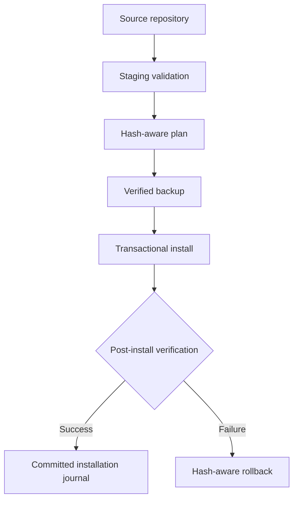

# Installation and rollback

Harness installation is a controlled promotion from reviewed source into the active Codex homes. Merely cloning this repository does not install or activate anything.

## General V2 migration

The migration program is [`staging/migration/v2_migrate.py`](../staging/migration/v2_migrate.py). It supports `snapshot`, `plan`, `install`, and `rollback`. Every invocation requires explicit `--codex-home` and `--agents-home` roots; mutation additionally requires a baseline and backup location.

A safe installation sequence is:

1. run deterministic staging validation;
2. snapshot the intended active targets;
3. inspect the plan against current hashes;
4. create and verify a private backup outside the install targets;
5. install using the validated source and journal;
6. verify active hashes, role pins, skills, toolbox behavior, and unchanged configuration;
7. roll back if installation or independent review fails.

Use `python3 staging/migration/v2_migrate.py --help` to inspect the current CLI before constructing a command. Do not reuse a baseline after active-state drift.

The migration replaces only its declared targets under `~/.codex` and `~/.agents`; it preserves unrelated skills and does not adopt real projects. Machine backups are local data and are excluded from this repository.

## Parent model is a separate gate

Ordinary V2 installation leaves `~/.codex/config.toml` unchanged. The approved parent is GPT-5.6 Sol/medium. [`staging/migration/migrate_parent_model.py`](../staging/migration/migrate_parent_model.py) is a separate, reversible, evidence-bound migration and is currently **blocked** because Luna/medium failed the parent quality gate. Do not couple it to routine V2 installation.

## Recovery guarantees

The general migration records original bytes, hashes, modes, target presence, and per-action journal state. It stops on unexpected drift, writes atomically where practical, and rejects rollback when targets changed after installation. See the [migration plan](../staging/migration/migration_plan.md), [rollback plan](../staging/migration/rollback_plan.md), and [latest installation audit](../staging/audit/HARNESS_V2_HYBRID_INSTALL_20260902T231047Z.md).
