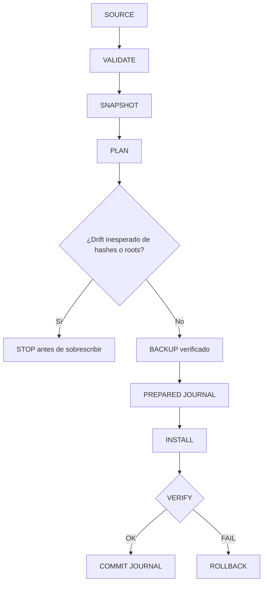
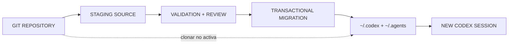
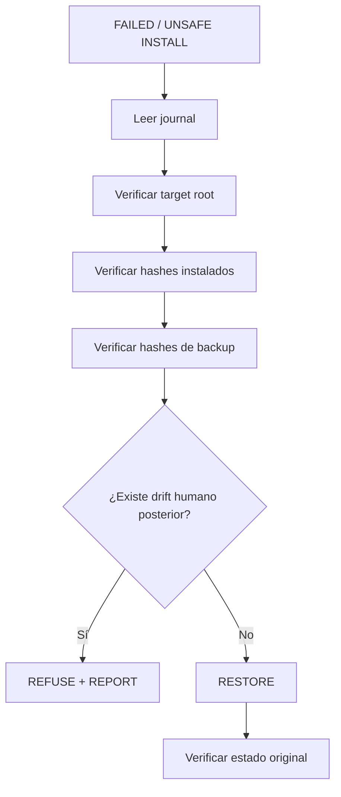

# Instalación y rollback

La instalación del harness es una promoción controlada desde fuente revisada hacia los homes activos de Codex. Clonar este repositorio no instala ni activa nada por sí solo.

El journal registra intención duradera antes de cada mutación. Cualquier drift del target, root, candidato o universo de targets detiene la instalación antes de sobrescribir; un fallo posterior entra en rollback basado en hashes.

## Migración general V2

El programa de migración es [`staging/migration/v2_migrate.py`](../staging/migration/v2_migrate.py). Admite `snapshot`, `plan`, `install` y `rollback`. Cada invocación exige roots explícitos mediante `--codex-home` y `--agents-home`; las mutaciones también requieren un baseline y una ubicación para el backup.

Una secuencia de instalación segura es:

1. ejecutar la validación determinista de staging;
2. tomar un snapshot de los targets activos previstos;
3. inspeccionar el plan contra los hashes actuales;
4. crear y verificar un backup privado fuera de los targets de instalación;
5. instalar utilizando la fuente y el journal validados;
6. verificar los hashes activos, los pins de roles, las skills, el comportamiento de la toolbox y que la configuración siga sin cambios;
7. ejecutar rollback si falla la instalación o la revisión independiente.

Usa `python3 staging/migration/v2_migrate.py --help` para inspeccionar la CLI actual antes de construir un comando. No reutilices un baseline después de que cambie el estado activo.

La migración sólo reemplaza sus targets declarados bajo `~/.codex` y `~/.agents`; conserva las skills no relacionadas y no adopta proyectos reales. Los backups de la máquina son datos locales y se excluyen de este repositorio.

## De Git al runtime activo

Clonar o modificar el repositorio sólo cambia fuente inerte. La activación requiere validación, revisión y una migración explícita; una sesión nueva consume después los homes instalados.

## El modelo parent es un gate separado

La instalación V2 ordinaria deja `~/.codex/config.toml` sin cambios. El parent aprobado es GPT-5.6 Sol/medium. [`staging/migration/migrate_parent_model.py`](../staging/migration/migrate_parent_model.py) es una migración separada, reversible y vinculada a evidencia que actualmente está **bloqueada** porque Luna/medium no superó el quality gate del parent. No la acoples a la instalación V2 rutinaria.

## Garantías de recuperación

La migración general registra los bytes originales, hashes, modos, existencia de targets y estado del journal para cada acción. Se detiene ante cambios inesperados, escribe de forma atómica cuando resulta práctico y rechaza el rollback si los targets cambiaron después de la instalación. Consulta el [plan de migración](../staging/migration/migration_plan.md), el [plan de rollback](../staging/migration/rollback_plan.md) y la [última auditoría de instalación](../staging/audit/HARNESS_V2_HYBRID_INSTALL_20260902T231047Z.md).

Rollback restaura bytes registrados, no reconstrucciones. Si un archivo cambió después de instalarse, se niega a sobrescribir ese trabajo humano y reporta la discrepancia.
