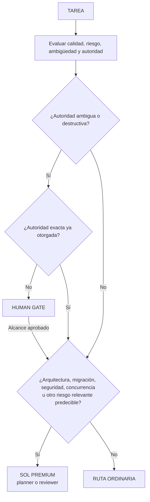
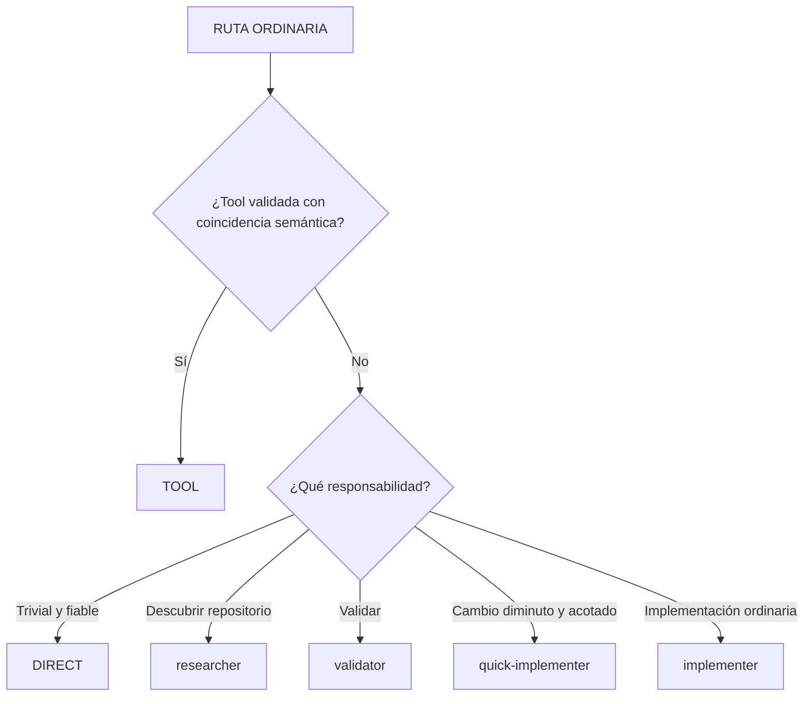
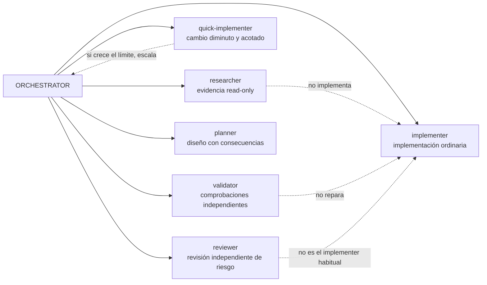
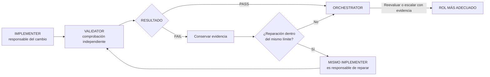
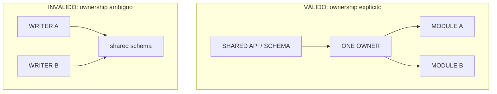
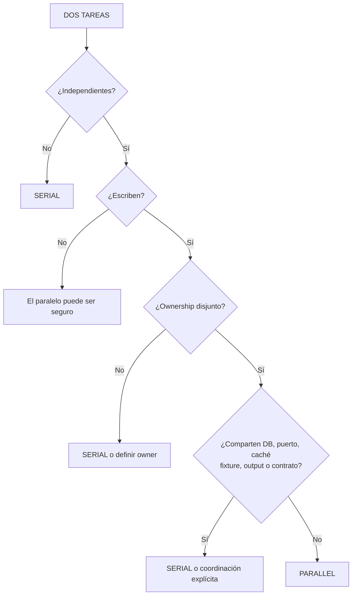

# Enrutamiento de modelos que prioriza la calidad

El enrutamiento protege primero el resultado requerido y sólo después optimiza la eficiencia:

1. corrección;
2. seguridad;
3. calidad de razonamiento requerida por la tarea;
4. fiabilidad y reproducibilidad;
5. coste, tokens, contexto y latencia entre los candidatos que satisfacen los cuatro primeros puntos.

Por tanto, «cheapest sufficient» significa el más barato entre los candidatos que cumplen el nivel de calidad. No significa experimentar primero con modelos débiles.

## Catálogo híbrido validado

| Rol | Modelo | Esfuerzo | Sandbox | Responsabilidad |
|---|---|---|---|---|
| Orchestrator | GPT-5.6 Sol | medium | workspace-write | Interpretar, enrutar, integrar, aplicar gates e informar |
| Researcher | GPT-5.6 Luna | medium | read-only | Descubrimiento en varios archivos, trazado y evidencia compacta |
| Quick implementer | GPT-5.6 Luna | low | workspace-write | Cambios explícitos, acotados y de bajo riesgo |
| Implementer | GPT-5.6 Luna | medium | workspace-write | Features normales, correcciones en varios archivos y reparación enfocada |
| Validator | GPT-5.6 Luna | low | workspace-write | Ejecutar las comprobaciones asignadas sin reparar la fuente |
| Planner | GPT-5.6 Sol | medium | read-only | Planificación y arquitectura con consecuencias relevantes |
| Reviewer | GPT-5.6 Sol | low | read-only | Revisión independiente justificada por el riesgo |

Validator usa workspace-write porque las comprobaciones habituales crean cachés y artefactos de build. Su contrato prohíbe editar fuente/configuración y exige evidencia del estado anterior y posterior.

## Ruta de decisión

El primer árbol resuelve autoridad y riesgo predictivo antes de ejecutar: no existe una ruta implícita «Luna primero, Sol si falla». El segundo selecciona la responsabilidad ordinaria. Las tools del proyecto tienen prioridad sobre las globales sólo para la misma responsabilidad semántica; los nombres o tags parecidos no demuestran compatibilidad.

## Responsabilidades de los agentes

Las líneas discontinuas marcan límites de responsabilidad, no transferencias automáticas. El orquestador conserva la integración y reasigna el trabajo cuando el alcance deja de coincidir con el rol.

## Bucle de implementación, reparación y validación

Una validación fallida ordinaria vuelve al implementer responsable antes de revalidarse. Si la evidencia demuestra que el límite cambió, el orquestador reevalúa o escala conservando esa evidencia. Este ownership explícito evita que el validator repare silenciosamente o que el contexto del fallo se pierda.

## Ownership de contratos compartidos

Los módulos independientes pueden implementarse en paralelo sólo después de asignar un único owner para cada API, schema o contrato compartido. Dos writers no deben cambiar el mismo contrato sin coordinación explícita.

## Escalamiento y contexto

El escalamiento puede ser predictivo. Las migraciones, los límites de seguridad, los datos duraderos, la concurrencia, las API públicas, los cambios destructivos y la arquitectura con consecuencias relevantes pueden enrutarse directamente a Sol. Una complejidad inesperada también puede provocar un escalamiento después de que el trabajo más barato conserve e informe su evidencia; la tarea no se reinicia a ciegas.

Cada subagente recibe su responsabilidad exacta, contratos requeridos, restricciones, ownership, límite de human gate y fallos anteriores pertinentes. Se evita copiar toda la conversación salvo que comprimirla elimine significado necesario. El trabajo paralelo requiere lecturas genuinamente independientes u ownership de escritura explícito y no solapado.

## Decisión de paralelismo

La independencia lógica no basta si las tareas comparten recursos mutables. Ante duda sobre una superficie de escritura o contrato, se ejecutan en serie hasta definir ownership y aislamiento.

La política de runtime bajo demanda procede de [`staging/global/codex/routing/MODEL_ROUTING.md`](../staging/global/codex/routing/MODEL_ROUTING.md).
