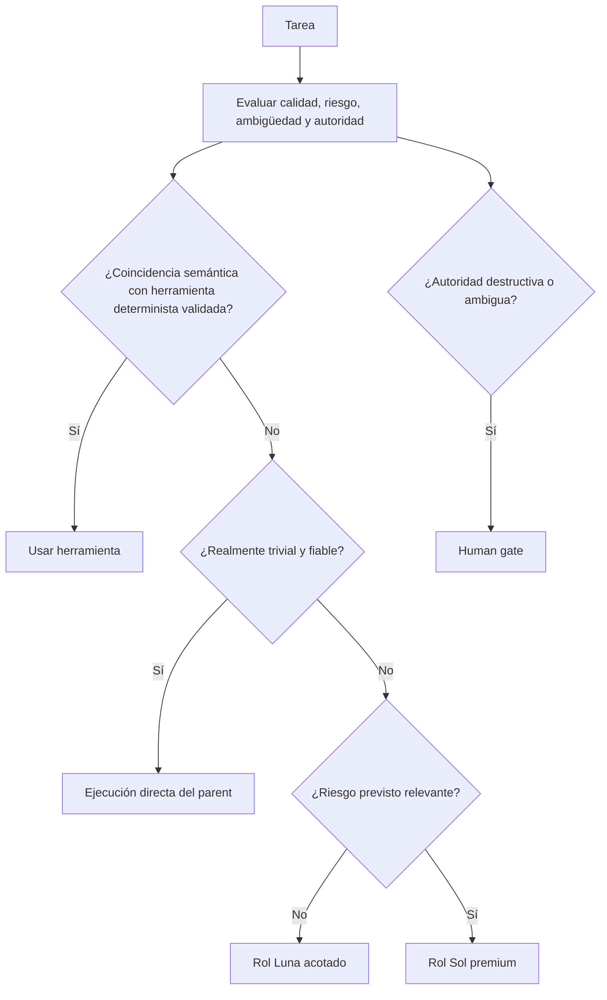

# Enrutamiento de modelos que prioriza la calidad

El enrutamiento protege primero el resultado requerido y sólo después optimiza la eficiencia:

1. corrección;
2. seguridad;
3. calidad de razonamiento requerida por la tarea;
4. fiabilidad y reproducibilidad;
5. coste, tokens, contexto y latencia entre los candidatos que satisfacen los cuatro primeros puntos.

Por tanto, «cheapest sufficient» significa el más barato entre los candidatos que cumplen el nivel de calidad. No significa experimentar primero con modelos débiles.

## Catálogo híbrido validado

| Rol | Modelo | Esfuerzo | Sandbox | Responsabilidad |
|---|---|---|---|---|
| Orchestrator | GPT-5.6 Sol | medium | workspace-write | Interpretar, enrutar, integrar, aplicar gates e informar |
| Researcher | GPT-5.6 Luna | medium | read-only | Descubrimiento en varios archivos, trazado y evidencia compacta |
| Quick implementer | GPT-5.6 Luna | low | workspace-write | Cambios explícitos, acotados y de bajo riesgo |
| Implementer | GPT-5.6 Luna | medium | workspace-write | Features normales, correcciones en varios archivos y reparación enfocada |
| Validator | GPT-5.6 Luna | low | workspace-write | Ejecutar las comprobaciones asignadas sin reparar la fuente |
| Planner | GPT-5.6 Sol | medium | read-only | Planificación y arquitectura con consecuencias relevantes |
| Reviewer | GPT-5.6 Sol | low | read-only | Revisión independiente justificada por el riesgo |

Validator usa workspace-write porque las comprobaciones habituales crean cachés y artefactos de build. Su contrato prohíbe editar fuente/configuración y exige evidencia del estado anterior y posterior.

## Ruta de decisión

Las herramientas del proyecto tienen prioridad sobre las globales sólo para la misma responsabilidad semántica. Los nombres o tags parecidos no demuestran compatibilidad.

## Escalamiento y contexto

El escalamiento puede ser predictivo. Las migraciones, los límites de seguridad, los datos duraderos, la concurrencia, las API públicas, los cambios destructivos y la arquitectura con consecuencias relevantes pueden enrutarse directamente a Sol. Una complejidad inesperada también puede provocar un escalamiento después de que el trabajo más barato conserve e informe su evidencia; la tarea no se reinicia a ciegas.

Cada subagente recibe su responsabilidad exacta, contratos requeridos, restricciones, ownership, límite de human gate y fallos anteriores pertinentes. Se evita copiar toda la conversación salvo que comprimirla elimine significado necesario. El trabajo paralelo requiere lecturas genuinamente independientes u ownership de escritura explícito y no solapado.

La política de runtime bajo demanda procede de [`staging/global/codex/routing/MODEL_ROUTING.md`](../staging/global/codex/routing/MODEL_ROUTING.md).
