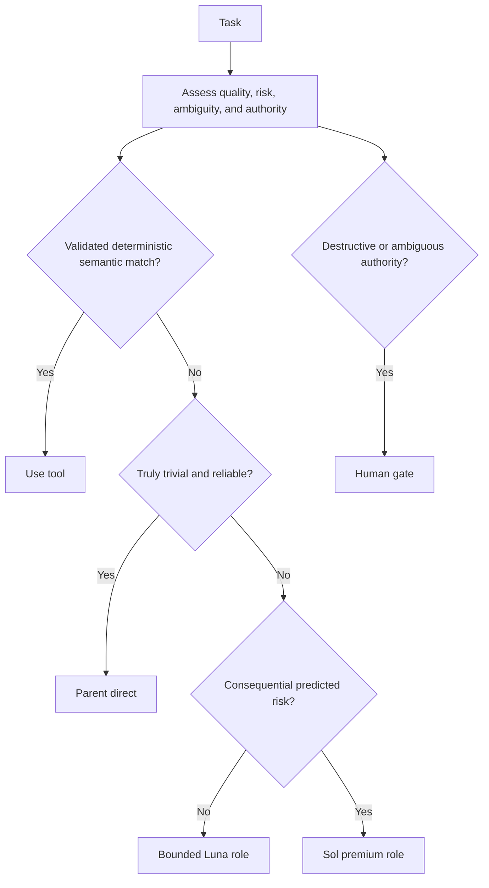

# Quality-first model routing

Routing protects the required outcome first and optimizes efficiency only afterward:

1. correctness;
2. safety;
3. task-required reasoning quality;
4. reliability and reproducibility;
5. cost, tokens, context, and latency among candidates meeting the first four.

“Cheapest sufficient” therefore means cheapest among quality-qualified candidates. It is not weak-model-first experimentation.

## Validated hybrid catalog

| Role | Model | Effort | Sandbox | Responsibility |
|---|---|---|---|---|
| Orchestrator | GPT-5.6 Sol | medium | workspace-write | Interpret, route, integrate, gate, and report |
| Researcher | GPT-5.6 Luna | medium | read-only | Multi-file discovery, tracing, and compact evidence |
| Quick implementer | GPT-5.6 Luna | low | workspace-write | Explicit low-risk bounded changes |
| Implementer | GPT-5.6 Luna | medium | workspace-write | Normal features, multi-file fixes, and focused repair |
| Validator | GPT-5.6 Luna | low | workspace-write | Run assigned checks without repairing source |
| Planner | GPT-5.6 Sol | medium | read-only | Consequential planning and architecture |
| Reviewer | GPT-5.6 Sol | low | read-only | Risk-justified independent review |

Validator uses workspace-write because common checks create caches and build artifacts. Its contract forbids source/config edits and requires before/after status evidence.

## Decision path

Project tools take precedence over global tools only for the same semantic responsibility. Similar names or tags do not establish compatibility.

## Escalation and context

Escalation can be predictive. Migrations, security boundaries, durable data, concurrency, public APIs, destructive changes, and consequential architecture may route directly to Sol. Unexpected complexity can also escalate after cheaper work preserves and reports its evidence; the task is not blindly restarted.

Each subagent receives its exact responsibility, required contracts, constraints, ownership, human-gate boundary, and relevant prior failures. Whole-conversation copying is avoided unless compression would remove necessary meaning. Parallel work requires genuinely independent read concerns or explicit non-overlapping write ownership.

The on-demand runtime policy is sourced from [`staging/global/codex/routing/MODEL_ROUTING.md`](../staging/global/codex/routing/MODEL_ROUTING.md).
