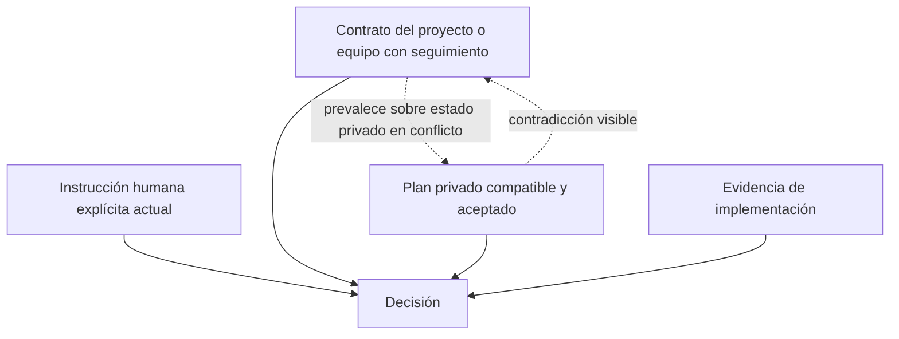

# Workspace privado del proyecto

`.ai/` existe para el coding agent de una persona. Es privado de forma predeterminada y no se convierte automáticamente en autoridad del proyecto o del equipo.

```text
.ai/
├── PROJECT.md
├── specs/
├── state/
├── run_state.md
├── handoff.md
├── mistakes.md
├── audit/
├── progress/
└── tools/
```

Esto es un menú. Un repositorio trivial puede no recibir nada; otro quizá sólo necesite `.ai/PROJECT.md`. No se instalan directorios vacíos ni blueprints completos por ceremonia.

## Enrutador y autoridad

`.ai/PROJECT.md` es un pequeño mapa de artefactos privados activos. Sólo debe enlazar specs, estado o manifests de herramientas privados y relevantes para la tarea; no debe duplicar el README, el `AGENTS.md` con seguimiento, los requisitos de producto, la arquitectura ni los comandos del equipo.



La evidencia del repositorio establece la realidad actual; las instrucciones y contratos aceptados que correspondan establecen el comportamiento deseado. Las contradicciones se informan, no se resuelven silenciosamente a favor de `.ai`.

## Privacidad local de Git

En repositorios Git, project-bootstrap resuelve tanto el root como la ruta de exclude:

```bash
git rev-parse --show-toplevel
git rev-parse --git-path info/exclude
```

Comprueba `git ls-files -- .ai .codex .agents` antes de añadir las exclusiones ancladas que falten para `/.ai/`, `/.codex/` y `/.agents/`. Conserva el contenido existente del exclude. Nunca edita el `.gitignore` con seguimiento, deja de seguir archivos, reescribe el historial ni supone que `.git/info/exclude` sea la ubicación resuelta.

Las rutas privadas aparentes que tengan seguimiento son un conflicto, no algo que una exclusión pueda ocultar. Los elementos existentes `ai/`, `specs/`, `.agents/`, `.codex/`, `.ai/` o un `AGENTS.md` raíz deben clasificarse según su seguimiento y autoridad, no según sus nombres.

## Promoción

Cuando el trabajo privado revela algo que los colaboradores necesitan, propón su promoción: explica la necesidad compartida, usa la convención de documentación existente en el repositorio y obtén aprobación cuando el cambio afecte un contrato del equipo o producto. El SDD privado nunca se copia automáticamente a documentación con seguimiento.
