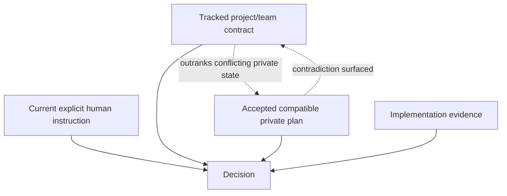

# Private project workspace

`.ai/` exists for one person's coding agent. It is private by default and is not automatically project or team authority.

```text
.ai/
├── PROJECT.md
├── specs/
├── state/
├── run_state.md
├── handoff.md
├── mistakes.md
├── audit/
├── progress/
└── tools/
```

This is a menu. A trivial repository may receive nothing; another may need only `.ai/PROJECT.md`. Empty directories and full blueprints are not installed for ceremony.

## Router and authority

`.ai/PROJECT.md` is a small map of active private artifacts. It should link only task-relevant private specs, state, or tool manifests and should not duplicate README, tracked `AGENTS.md`, product requirements, architecture, or team commands.



Repository evidence establishes current reality; applicable accepted instructions and contracts establish desired behavior. A contradiction is reported, not silently resolved in favor of `.ai`.

## Git-local privacy

For Git repositories, project-bootstrap resolves both the root and exclude path:

```bash
git rev-parse --show-toplevel
git rev-parse --git-path info/exclude
```

It checks `git ls-files -- .ai .codex .agents` before appending missing anchored exclusions for `/.ai/`, `/.codex/`, and `/.agents/`. Existing exclude content is preserved. It never edits tracked `.gitignore`, untracks files, rewrites history, or assumes `.git/info/exclude` is the resolved location.

Tracked private-looking paths are a conflict, not something exclusion can hide. Existing `ai/`, `specs/`, `.agents/`, `.codex/`, `.ai/`, or root `AGENTS.md` must be classified from tracking and authority rather than their names.

## Promotion

When private work reveals something collaborators need, propose promotion: explain the shared need, use the repository's existing documentation convention, and obtain approval when the change affects a team or product contract. Private SDD is never copied into tracked documentation automatically.
