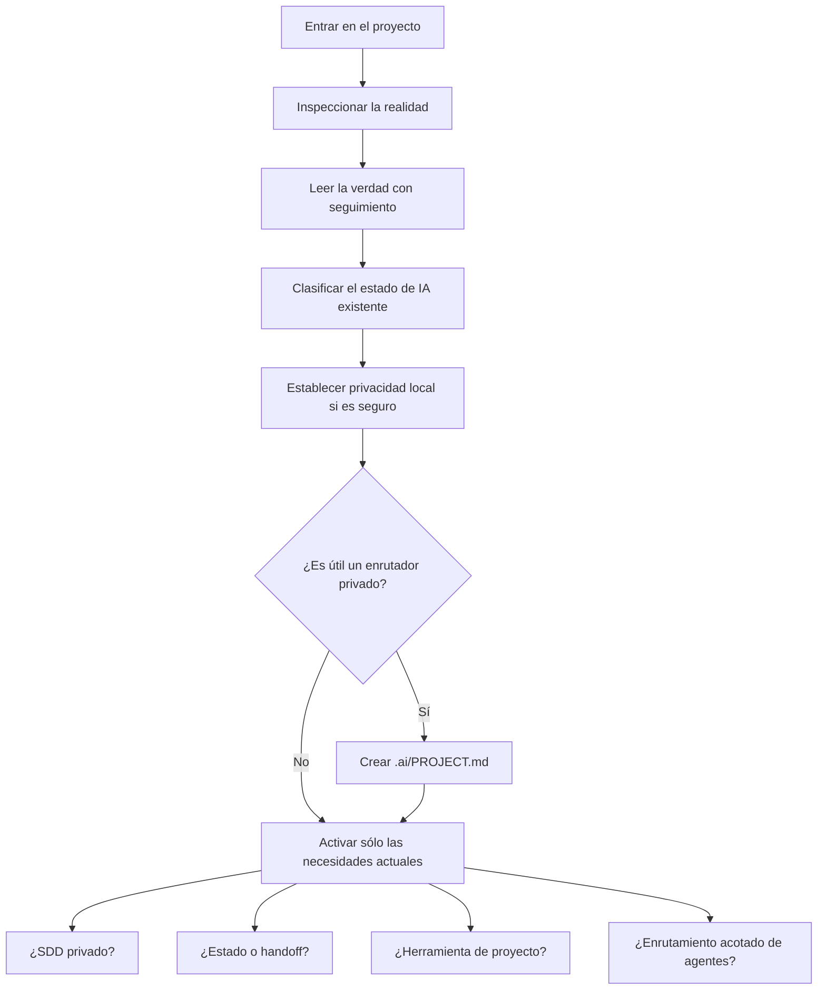

# Bootstrap adaptativo de proyectos

project-bootstrap no instala un árbol estándar de carpetas. Inspecciona el repositorio, clasifica el estado existente y propone la capa privada útil más pequeña para Codex.

## Clasificación

| Clase | Significado |
|---|---|
| `REUSE` | Un artefacto existente ya es responsable de esa función |
| `ADAPT` | Responsabilidad útil, ajustada a la realidad del proyecto |
| `MIGRATION_PROPOSED` | Un traslado o reemplazo podría ayudar, pero requiere aprobación |
| `CONFLICT` | El seguimiento, la autoridad, el contenido o la seguridad de la ruta impiden la adopción automática |
| `SKIP` | No hay una necesidad activa o se produciría una duplicación |

Bootstrap resuelve la raíz Git más cercana, lee las instrucciones y convenciones con seguimiento que correspondan, inspecciona el estado y los symlinks e identifica rutas existentes que parezcan relacionadas con IA. Los directorios sin Git no se inicializan automáticamente. Los layouts antiguos nunca se trasladan, renombran ni eliminan silenciosamente.

La inspección de privacidad precede cualquier paso de aplicación. El helper sólo añade patrones de exclude locales cuando no hay conflictos con rutas privadas que tengan seguimiento. Los assets de plantillas son un menú inerte y deben seguir siendo autosuficientes para que la skill instalada nunca dependa de este checkout fuente.

Tras una creación autorizada, bootstrap verifica límites, exclusiones, enlaces, placeholders, modos, responsabilidades duplicadas, contradicciones, tamaño del contexto y comprobaciones pertinentes del proyecto. Informa por separado los elementos creados, reutilizados, omitidos, en conflicto y sin validar.

Fuente: [`staging/global/agents/skills/project-bootstrap/`](../staging/global/agents/skills/project-bootstrap/).
