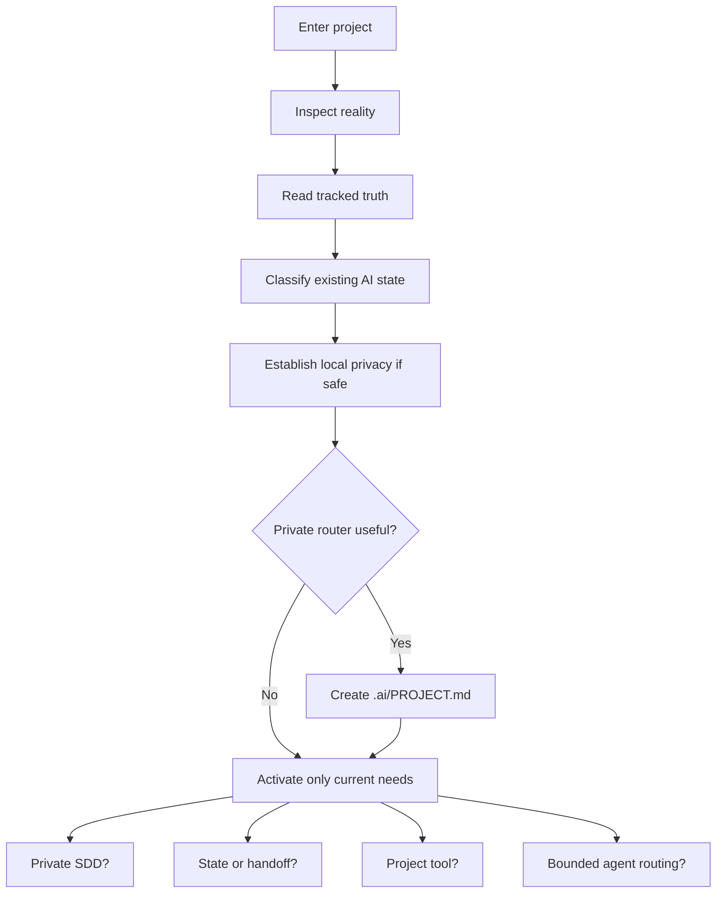

# Adaptive project bootstrap

project-bootstrap does not install a standard folder tree. It inspects the repository, classifies existing state, and proposes the smallest useful private Codex layer.

## Classification

| Class | Meaning |
|---|---|
| `REUSE` | Existing artifact already owns the responsibility |
| `ADAPT` | Useful responsibility, adjusted to project reality |
| `MIGRATION_PROPOSED` | A move or replacement may help but needs approval |
| `CONFLICT` | Tracking, authority, content, or path safety prevents automatic adoption |
| `SKIP` | No active need or duplication would result |

Bootstrap resolves the nearest Git root, reads applicable tracked instructions and conventions, inspects status and symlinks, and identifies existing AI-looking paths. Non-Git directories are not initialized automatically. Existing old layouts are never silently moved, renamed, or deleted.

Privacy inspection precedes any apply step. The helper appends local exclude patterns only when no tracked private-path conflict exists. Template assets are an inert menu and must remain self-contained so the installed skill never depends on this source checkout.

After authorized creation, bootstrap verifies boundaries, exclusions, links, placeholders, modes, duplicate responsibility, contradictions, context size, and relevant project checks. It reports created, reused, skipped, conflicting, and unvalidated items separately.

Source: [`staging/global/agents/skills/project-bootstrap/`](../staging/global/agents/skills/project-bootstrap/).
