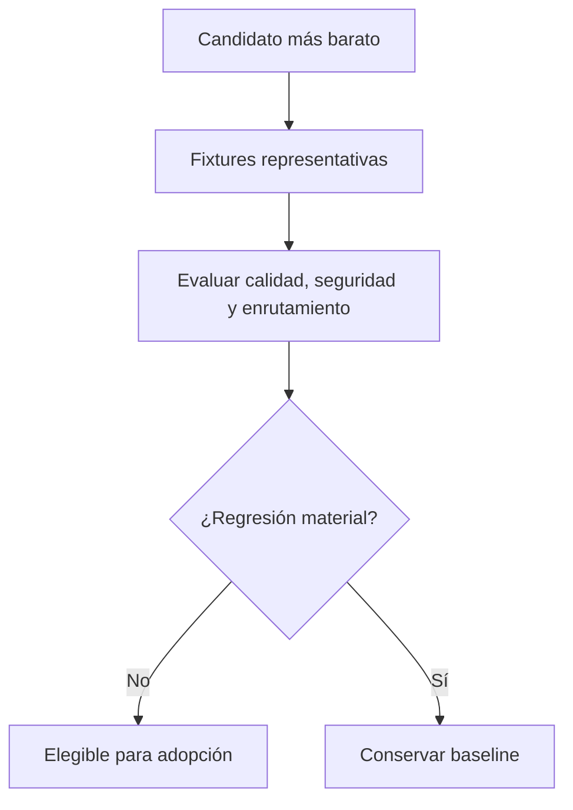

# Quality red-team

El gate V2 intentó refutar la afirmación de que un enrutamiento más barato conservaba la calidad requerida. Comparó resultados en vez de prosa y trató como materiales los problemas de seguridad, autoridad, requisitos omitidos, reparación incompleta y enrutamiento incorrecto.

## Método del gate

La comparación autoritativa del parent utilizó un único prompt incluido en el repositorio, contextos aislados, primero el control Sol/medium, después el candidato Luna/medium y outputs exactos conservados. Un prompt factual idéntico y complementario cerró un gap de evidencia. Los manifests dirigidos por contenido vinculan fixtures, resultados, prompts, outputs, evaluator y comprobantes de migración.

## Resultado del parent

| Configuración | PASS | PASS_WITH_MINOR_DIFFERENCE | ROUTING_REGRESSION | SAFETY_REGRESSION |
|---|---:|---:|---:|---:|
| Control Sol/medium | 24 | 0 | 0 | 0 |
| Candidato Luna/medium | 18 | 3 | 3 | 0 |

El parent Luna falló porque:

- omitió la revisión premium en una migración con posible pérdida de datos;
- no devolvió una implementación fallida a su implementer responsable antes de revalidarla;
- asignó trabajo compartido de protocolo/schema público sin un único responsable del contrato.

Conclusión: `KEEP_SOL_MEDIUM_PARENT`.

## Gates independientes de workers

La prueba de researcher reveló un fallo de calidad de evidencia con Luna/low: trató un test limitado al docstring como confirmación de comportamiento. Luna/medium identificó correctamente la aserción ausente y se convirtió en la asignación validada.

Validator permaneció en Luna/low, pero su contrato de rol original no clasificaba con precisión las comprobaciones que sólo tenían skips ni la mutación de fuente con exit zero. Se corrigió el contrato y una ejecución nueva pasó. Las comprobaciones asignadas no válidas o con todos los tests omitidos ahora son `BLOCKED`; la mutación de fuente con seguimiento hace fallar la validación con independencia del exit status del proceso.

La implementación rápida, la implementación normal, la planificación premium y la revisión premium superaron sus fixtures específicas de rol. Este resultado híbrido es el resultado deseado que prioriza la calidad: los roles más baratos sólo sobreviven donde su propia evidencia los respalda; no es necesario abaratar el parent para que V2 tenga éxito.

## Evidencia

- [Informe de red-team](../staging/audit/quality/REDTEAM_REPORT.md)
- [Artefactos exactos de las pruebas](../staging/audit/quality/TRIAL_ARTIFACTS.md)
- [Resultados legibles por máquinas](../staging/audit/quality/redteam_results.json)
- [Revisión independiente](../staging/audit/quality/INDEPENDENT_REVIEW.md)
