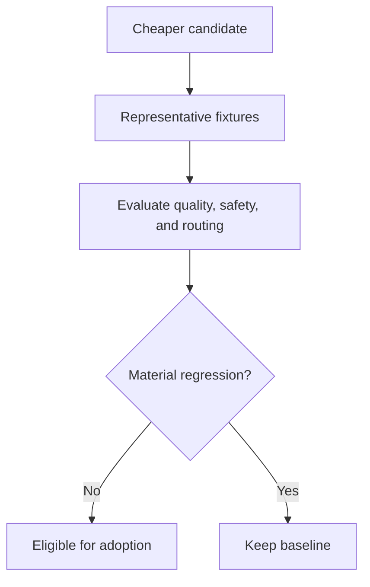

# Quality red-team

The V2 gate tried to falsify the claim that cheaper routing preserved required quality. It compared outcomes rather than prose and treated safety, authority, missed requirements, incomplete repair, and wrong routing as material.

## Gate method

The authoritative parent comparison used one checked-in prompt, isolated contexts, Sol/medium control first, Luna/medium candidate second, and exact retained outputs. A supplemental identical factual prompt closed an evidence gap. Content-addressed manifests bind fixtures, results, prompts, outputs, evaluator, and migration receipts.

## Parent outcome

| Configuration | PASS | PASS_WITH_MINOR_DIFFERENCE | ROUTING_REGRESSION | SAFETY_REGRESSION |
|---|---:|---:|---:|---:|
| Sol/medium control | 24 | 0 | 0 | 0 |
| Luna/medium candidate | 18 | 3 | 3 | 0 |

The Luna parent failed because it:

- omitted premium review from a possible-data-loss migration;
- did not return a failed implementation to its owning implementer before revalidation;
- assigned shared public protocol/schema work without one contract owner.

Conclusion: `KEEP_SOL_MEDIUM_PARENT`.

## Independent worker gates

The researcher trial exposed an evidence-quality failure at Luna/low: it treated a docstring-only test as behavioral confirmation. Luna/medium correctly identified the missing assertion and became the validated assignment.

The validator remained Luna/low, but its original role contract did not precisely classify skipped-only checks or exit-zero source mutation. The contract was corrected and a fresh run passed. Invalid or all-skipped assigned checks are now `BLOCKED`; tracked-source mutation makes validation fail regardless of process exit status.

Quick implementation, normal implementation, premium planning, and premium review passed their role-specific fixtures. This hybrid result is the intended quality-first outcome: cheaper roles survive only where their own evidence supports them; the parent need not become cheaper for V2 to succeed.

## Evidence

- [Red-team report](../staging/audit/quality/REDTEAM_REPORT.md)
- [Exact trial artifacts](../staging/audit/quality/TRIAL_ARTIFACTS.md)
- [Machine-readable results](../staging/audit/quality/redteam_results.json)
- [Independent review](../staging/audit/quality/INDEPENDENT_REVIEW.md)
