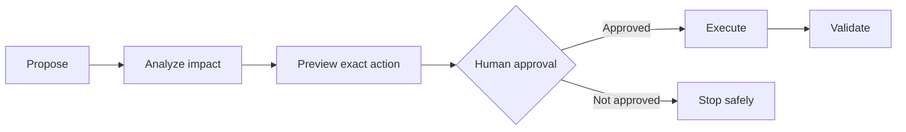

# Safety and human gates

Sandboxing limits technical access. Human gates govern meaning and authority.

The gate applies before insufficiently authorized actions with material irreversible, destructive, lossy, production, security, infrastructure, protected-content, public-contract, or broad impact. Common harness examples include:

- schema and durable-data migration;
- destructive or difficult-to-reverse operations;
- security-boundary changes;
- global toolbox promotion, especially mutating tools;
- consequential private-to-shared documentation promotion;
- installation over unexpected active drift;
- any parent-model migration.

Approval identifies the action and target. Once that exact action is approved, the harness should not ask ceremonially again. Broader or materially changed actions require a new gate.

Repeated requests, prior successful execution, tool availability, or a model's confidence never create authority. Private `.ai` state cannot waive tracked project gates. When authoritative sources conflict, surface the contradiction and request the missing decision instead of silently choosing.

Validation is part of the gate: report what ran, what failed, what changed, and what remains uncertain. A blocked environment is not evidence of product failure, and an exit-zero validator command that mutates tracked source is still a validation failure.
