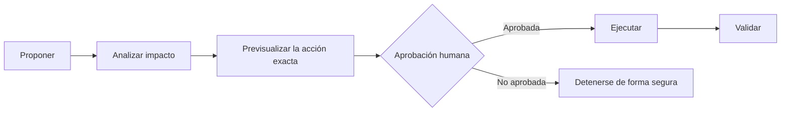
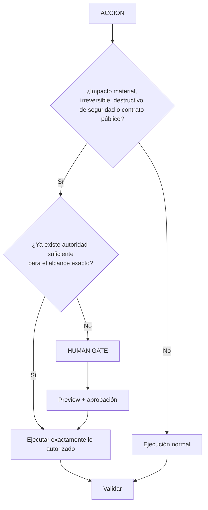

# Seguridad y human gates

El sandbox limita el acceso técnico. Los human gates gobiernan el significado y la autoridad.

El gate se aplica antes de acciones con autorización insuficiente y un impacto material irreversible, destructivo, con pérdidas, de producción, seguridad, infraestructura, contenido protegido, contrato público o alcance amplio. Algunos ejemplos habituales del harness son:

- migración de schemas y datos duraderos;
- operaciones destructivas o difíciles de revertir;
- cambios en límites de seguridad;
- promoción a la toolbox global, especialmente de herramientas que mutan;
- promoción relevante de documentación privada a compartida;
- instalación sobre cambios inesperados en el estado activo;
- cualquier migración del modelo parent.

La aprobación identifica la acción y el target. Una vez aprobada esa acción exacta, el harness no debe volver a preguntar por ceremonia. Las acciones más amplias o con cambios materiales requieren un gate nuevo.

El gate distingue impacto de autorización: una acción de alto impacto ya autorizada de forma clara y específica no provoca preguntas repetidas. Si cambia el target o se amplía materialmente el alcance, se necesita una decisión nueva.

Las solicitudes repetidas, una ejecución previa correcta, la disponibilidad de una herramienta o la confianza de un modelo nunca crean autoridad. El estado privado `.ai` no puede eludir los gates del proyecto con seguimiento. Cuando las fuentes autoritativas entren en conflicto, muestra la contradicción y solicita la decisión que falta en vez de elegir silenciosamente.

La validación forma parte del gate: informa qué se ejecutó, qué falló, qué cambió y qué sigue siendo incierto. Un entorno bloqueado no demuestra un fallo del producto, y un comando validator con exit zero que muta fuente con seguimiento sigue siendo un fallo de validación.
