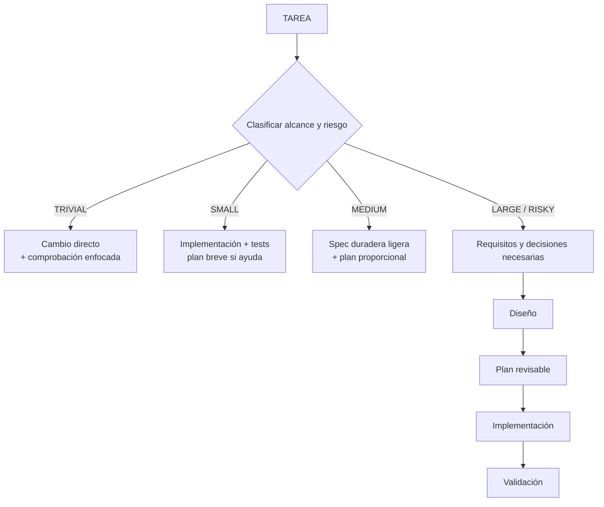

# Desarrollo proporcional basado en especificaciones

El desarrollo basado en especificaciones (SDD) hace explícito el razonamiento duradero cuando eso mejora la corrección. Es proporcional, no un pipeline obligatorio de documentos.

Este es un ciclo conceptual: cualquier etapa puede comprimirse u omitirse cuando no beneficie a la tarea, y una etapa no implica necesariamente crear un archivo.

## Selección proporcional

La clasificación depende del riesgo y la durabilidad del contrato, no sólo del número de archivos.

| Clase de tarea | Tratamiento habitual |
|---|---|
| Trivial | Trabajo directo y una comprobación evidente |
| Pequeña | Implementación y tests enfocados; plan breve sólo si resulta útil |
| Mediana | Especificación duradera y ligera para reglas o interfaces importantes |
| Grande/arriesgada | Artefactos seleccionados de requisitos, decisión, especificación, diseño y plan que el riesgo justifique |

No hay un `tasks.md` obligatorio, y el trabajo grande no requiere automáticamente todos los archivos posibles. El trabajo con datos duraderos, seguridad, migración, concurrencia, contratos públicos y arquitectura con consecuencias relevantes suele necesitar una planificación y decisiones humanas más sólidas de lo que sugiere únicamente la cantidad de archivos.

El SDD personal utiliza `.ai/specs/<feature>/` de forma predeterminada. Una feature pequeña puede usar un único `spec.md`; el trabajo más grande puede separar requisitos, decisión, especificación, diseño y plan. Estos artefactos privados guían al agente, pero no se convierten automáticamente en requisitos del equipo.

Si una decisión o requisito pasa a afectar realmente al equipo, propón su promoción a la convención de documentación compartida existente en el repositorio. Explica por qué lo necesitan los colaboradores y obtén aprobación cuando cambie un contrato del proyecto o equipo.
