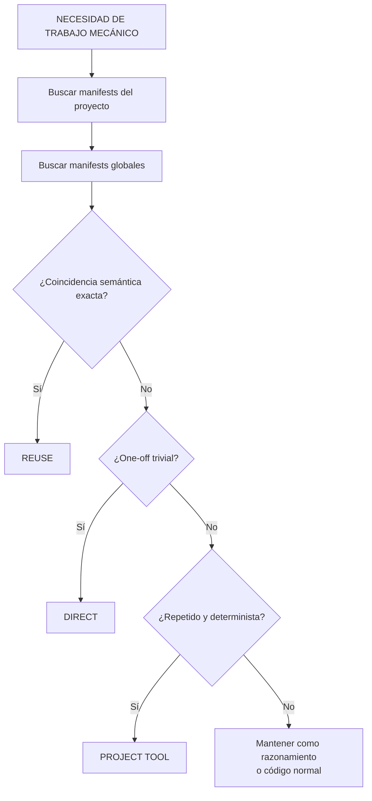
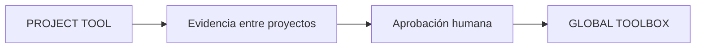
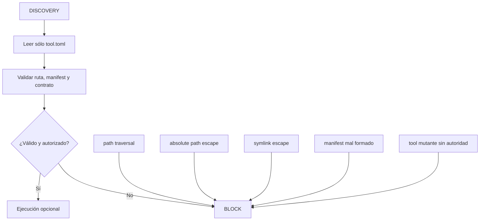

# Toolbox determinista reutilizable

Una **skill** enseña cómo trabajar o razonar. Una **tool** realiza una responsabilidad mecánica determinista. Las elecciones de arquitectura, la interpretación ambigua y las decisiones de dominio siguen siendo razonamiento; el inventario, los hashes, la comparación de manifests, la validación y las transformaciones estables pueden convertirse en herramientas.

## Ámbitos y paquete

Las herramientas privadas del proyecto residen en `.ai/tools/<name>/`. Las herramientas entre proyectos residen en `~/.codex/toolbox/<name>/` y requieren una aprobación explícita de promoción.

```text
tool/
├── tool.toml
├── tool.py
└── test_tool.py
```

La biblioteca estándar de Python es el valor genérico predeterminado, aunque el lenguaje ya utilizado por un proyecto puede encajar mejor. El pequeño manifest sólo declara metadata relevante para el descubrimiento, como name, description, tags, entrypoint, test, determinism y mutation.

## Descubrimiento y extracción



Se buscan los manifests del proyecto antes que los globales. La prioridad del proyecto sólo se aplica cuando coincide la responsabilidad semántica; un filename o tag parecido no basta. El código fuente sólo se lee al modificar, depurar, revisar o resolver una interfaz insuficiente.

La extracción considera el determinismo, la recurrencia, la estabilidad semántica, el coste de validación, la seguridad y el beneficio en tokens. No es una regla rígida basada en cantidad de líneas. Un segundo helper sustancialmente equivalente es una evidencia sólida a favor de la extracción; la repetición nunca convierte el criterio en una herramienta determinista.



Una tool local no se promociona por existir ni por usarse una vez. La promoción exige semántica genérica estable, tests, revisión de dependencias y gestión de colisiones.

## Seguridad



El descubrimiento no ejecuta código fuente. La ejecución es un paso posterior y opcional, sólo tras validar el paquete y comprobar la autoridad de la tarea.

El descubrimiento parsea manifests y nunca ejecuta entrypoints ni tests. La validación rechaza nombres inseguros, rutas absolutas o con traversal, TOML mal formado, escapes mediante symlinks de paquetes/rutas y campos booleanos no válidos. Los tests sólo se ejecutan cuando se solicitan explícitamente. Las herramientas que mutan deben declarar su superficie y contar con autoridad para la tarea.

Un proyecto nunca debe escribir silenciosamente en la toolbox global. La promoción global requiere aprobación humana, evidencia repetida entre proyectos, semántica genérica estable, tests, revisión de dependencias y gestión de colisiones. Las herramientas globales que mutan requieren aprobación explícita.

La utilidad del sistema admite operaciones compactas `list`, `search`, `validate` y `scaffold` local al proyecto y seguro. Su fuente es [`staging/global/codex/toolbox/_system/toolbox.py`](../staging/global/codex/toolbox/_system/toolbox.py).
