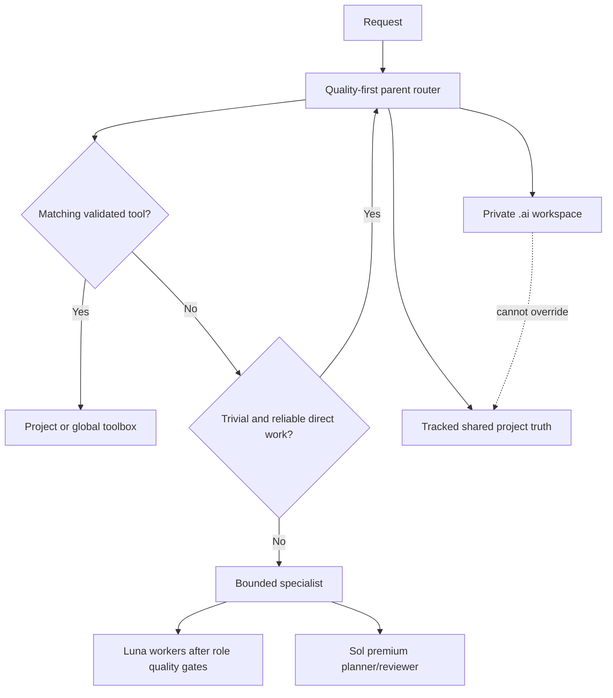

# Unified Harness V2 staging

This tree is a reviewable, non-installed candidate integrating three systems:

## Installable control

The staged installable parent remains GPT-5.6 Sol with medium reasoning. Luna/medium is an inert future candidate and has a separate quality-gated migration path. General V2 installation never changes `config.toml`.

## Private project workspace

`blueprint/project` and the byte-identical project-bootstrap assets are menus of `.ai/` templates. Bootstrap creates only justified artifacts, uses repository-local Git exclusion, and never turns private guidance into shared team policy automatically.

## Tools and routing

The standard-library toolbox utility discovers manifests without executing tools, validates containment, optionally runs declared tests only on request, and scaffolds only project-local packages without overwrite. The on-demand model-routing policy places correctness, safety, required reasoning quality, and reliability before efficiency.

## Validation and migration

`audit/validate_staging.py` runs deterministic infrastructure and policy tests without model calls. `audit/quality` defines outcome-based fixtures for the later Sol-control/Luna-candidate red team. `migration/v2_migrate.py` provides hash-aware general installation/rollback; `migration/migrate_parent_model.py` is a separate quality-gated optional model change.

Nothing in staging is installed merely by existing. Active homes, projects, Git excludes, and Git configuration remain outside this candidate.
