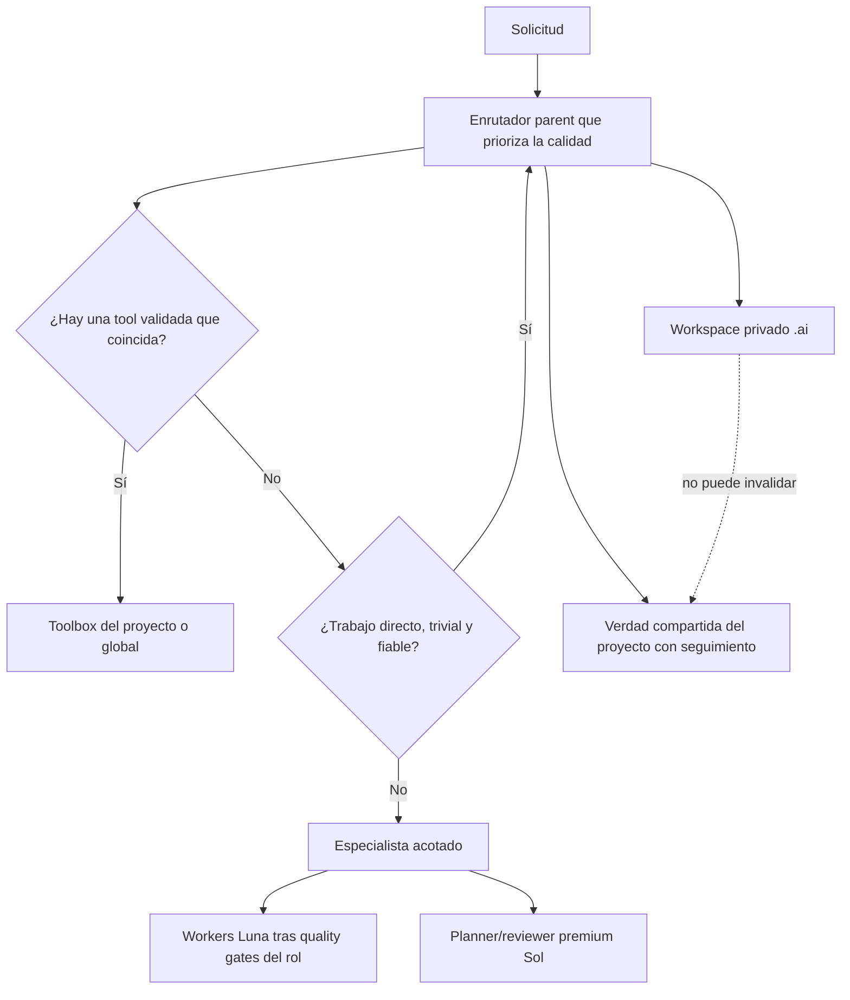

# Staging unificado del Harness V2

Este árbol es la fuente del híbrido V2 validado que integra tres sistemas:

## Control validado

El parent instalado y en staging sigue siendo GPT-5.6 Sol con razonamiento medium. Luna/medium no superó el quality gate del parent y permanece como candidato inerte y bloqueado con una ruta de migración separada. La instalación V2 general nunca cambia `config.toml`.

## Workspace privado del proyecto

`blueprint/project` y los assets byte-identical de project-bootstrap son menús de plantillas `.ai/`. Bootstrap sólo crea artefactos justificados, usa la exclusión de Git local al repositorio y nunca convierte automáticamente la orientación privada en política compartida del equipo.

## Tools y enrutamiento

La utilidad de toolbox basada en la biblioteca estándar descubre manifests sin ejecutar tools, valida la contención, opcionalmente ejecuta los tests declarados sólo si se solicita y sólo crea scaffolds de paquetes locales al proyecto sin sobrescribir. La política bajo demanda de enrutamiento de modelos antepone a la eficiencia la corrección, la seguridad, la calidad de razonamiento requerida y la fiabilidad.

## Validación y migración

`audit/validate_staging.py` ejecuta tests deterministas de infraestructura y políticas sin llamadas a modelos. `audit/quality` conserva el red-team completado y basado en resultados del control Sol y candidato Luna. Su resultado conservó el parent Sol/medium, elevó researcher a Luna/medium y endureció el contrato de validator Luna/low. `migration/v2_migrate.py` proporciona instalación/rollback general basado en hashes; `migration/migrate_parent_model.py` es un cambio de modelo separado y actualmente bloqueado.

Nada en staging se instala por el mero hecho de existir. La instalación local activa se promovió mediante la migración y se verificó por separado; los proyectos, los excludes de Git y las futuras ediciones de fuente permanecen sin cambios hasta que se adopten o instalen explícitamente.
